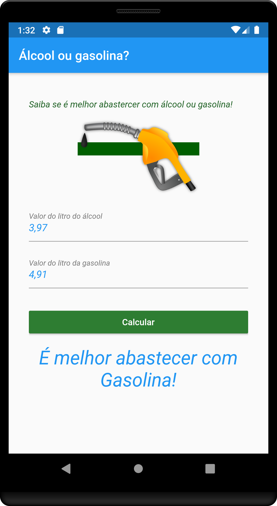

Álcool ou gasolina?

App desenvolvido com a linguagem Dart, faz um cálculo médio se é mais vantajoso abastecer com álcool ou gasolina, utiliza para cálculo a fórmula " índice = valorAlcool / valorGasolina, 
 se o indice for menor que 0.7: abastecer com álcool, caso contrário abastecer com gasolina".
 
 
 <h1>Tela do app</h1>
 
 

 
 
 
